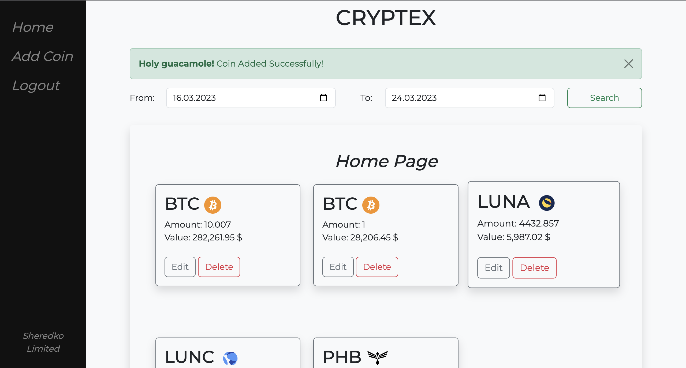

[](https://app.travis-ci.com/sh-andriy/CRYPTEX)
# ₿ CRYTPEX | The goal of a Project
<hr>




<p>

**<i>CRYPTEX</i>** - is a website where users can easily view information about crypto they own and manage their holdings. After registering on CRYPTEX, users will be able to add widgets for each cryptocurrency they own, specifying the type of a coin and the amount they have. These widgets will be displayed on the Home Page for a quick and easy access.

To get the necessary data about each cryptocurrency, the website will be using the Binance API, which provides real-time information on cryptocurrency prices, market trends, and more. This data will be stored in a database and used to update the user's holdings and widget displays.

My website will have three or more tables in a database that are properly connected with each other. 

Overall, the website will provide a streamlined way for users to track their cryptocurrency investments and stay informed about the profit they made on crypto. 
</p>
<br>

## To set up a project follow this steps:
### 1. Clone repo:
```terminal
git clone https://github.com/sh-andriy/CRYPTEX.git
```
<br>

### 2. Activate virtual environment:
```shell
virtualenv venv
```
```shell
source env/bin/activate
```
<br>

### 3. Install pip and upgrade it:
```shell
python -m ensurepip
```
#### or
```shell
python3 -m ensurepip
```
#### ugrade
```shell
python3 -m pip install –upgrade pip
```
<br>

### 4. Install all the project dependencies:
```shell
pip install -r requirements.txt
```
#### or
```shell
pip install .
```
<br>

## Configure MySQL Database:
<hr>

### 5. Set these environmental variables in .env file:
```shell
DB_HOST=<host>
DB_USERNAME=<username>
DB_PASSWORD=<password>
SECRET_KEY=<something>
```

### 6. Run migrations:

- `flask db init`
- `flask db migrate`
- `flask db upgrade`

### Run server:
```shell
flask run
```
#### or run `server.sh` file

## Congrats! You've gained access to the following:
<hr>

### Web App:
```shell
localhost:5000/
localhost:5000/login
localhost:5000/register
localhost:5000/add-balance
localhost:5000/edit-balance/<int:balance_id>
localhost:5000/delete-balance/<int:balance_id>
localhost:5000/logout
```

### Web Service:
```shell
localhost:5000/api/v1/users
localhost:5000/api/v1/users/<int:id>
localhost:5000/api/v1/coins
localhost:5000/api/v1/balances
localhost:5000/api/v1/balances/<int:id>
```
