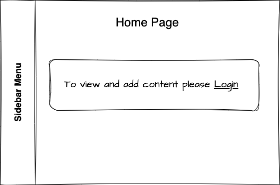
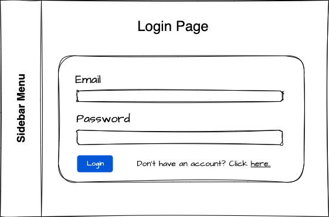
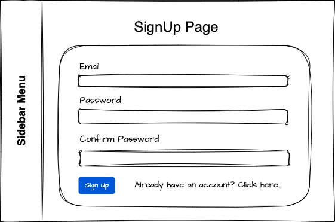

<h1 style="text-align:center;">CRYPTEX</h1>
<h3>Vision</h3>

"CRYPTEX" is a web-application which allows user to easily view information about crypto they own and manage their holdings.

Application should provide: 

- Streamlined viewing of cryptocurrency holdings
- Ability to add and manage widgets for each cryptocurrency owned
- Real-time data updates using the Binance API
- Properly interconnected database tables to support data management and storage
- Easy searching and filtering of cryptocurrency data
- Secure user registration and login system
- User-friendly interface and navigation for ease of use
- Responsive design for use on various devices and screen sizes
- Clear and concise display of cryptocurrency information and statistics
- Option to customize display preferences and settings

[//]: # (<h3>1. Widgets</h3>)

[//]: # (- <h4>Display of the widgets</h4>)

[//]: # (
The purpose of this mode is to allow users to view the widgets.
)
<h5><i>Main scenario:</i></h5>

   - User accesses the website and sees the Home page where widgets are located

Now User Click Login button an accesses the login page

Here, user are able to login with his credentials. If he does not have an account he click button "here" and being redirected to the Sign Up page

At this step user sees registration form where he creates an account

