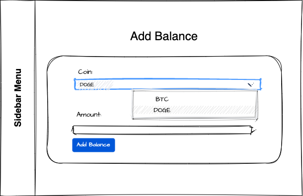

# CRYPTEX
## Vision

"CRYPTEX" is a web-application which allows user to easily view information about crypto they own and manage their holdings.

Application should provide: 

- Streamlined viewing of cryptocurrency holdings
- Ability to add and manage balances for each cryptocurrency owned
- Real-time data updates using the Binance API
- Properly interconnected database tables to support data management and storage
- Easy searching and filtering of cryptocurrency data
- Secure user registration and login system
- User-friendly interface and navigation for ease of use
- Responsive design for use on various devices and screen sizes
- Clear and concise display of cryptocurrency information and statistics
- Option to customize display preferences and settings

## 1. Users

### 1.1 Register new user

The purpose of this mode is to allow person to sign up a user.

#### <i>Main scenario:</i>

   - A new user accesses the website and sees the Home page:

Pic 1.1.1 View the home page.(for not logged-in users)

- Now User Clicks "Login" button and accesses the login page;
- Application displays login form:

Pic 1.1.2 View the login page.

- Here, user are able to log in with his credentials;
- If he does not have an account he clicks button "here" and being redirected to the Sign-Up page;
- Application displays registration form:

Pic 1.1.3 View the register page.

- User enters data and presses "Sign Up" button;
- If any data is entered incorrectly, incorrect data messages are displayed;
- If error occurs, then error message is displaying;
- If entered data is valid, then record is adding to database and user is automatically logged in and redirected to the home page.

### 1.2 Log In user

The purpose of this mode is to log in a user.

#### <i>Main scenario:</i>

   - A logged-out user wants to log in into the website;
   - He sees home page, clicks "Login" button and being redirected to the login page;
   - Application displays login form;
   - User enters data and presses "Login" button;
   - If any data is entered incorrectly, incorrect data messages are displayed;
   - If error occurs, then error message is displaying;
   - If entered data is valid, then user is logged in and redirected to the home page.

### 1.3 Log out user

The purpose of this mode is to log out a user.

#### <i>Main scenario:</i>

   - A logged-in user wants to log out;
   - He sees sidebar where "Log Out" button is located;
   - Application always displays sidebar;
   - User presses "Log Out" button;
   - Current user will be logged-out from the system and redirected to the home page.

## 2. Balances

### 2.1 Add a user's balance

The purpose of this mode is to allow a user to add his balance.

#### <i>Main scenario:</i>

   - When a user is logged-in, he sees a home page;
   - Application displays Home Page for logged-in users only:

Pic 2.1.1 View the Home Page(for logged-in users)

   - User presses the "$$$" button and being redirected to the Add Balance Page;
   - Application displays add-balance form:

Pic 2.1.2 View the AddBalance Page.

   - User selects a cryptocurrency from SelectField;
   - Enters an amount of chosen coin in DecimalField;
   - If any data is entered incorrectly, incorrect data messages are displayed;
   - If error occurs, then error message is displaying;
   - If entered data is valid, then balance is adding to database and user being redirected to the Home Page.

### 2.2 Edit a user's balance

The purpose of this mode is to allow a user to edit his balance.

#### <i>Main scenario:</i>

   - When user wants to edit his holdings he clicks "Edit" button on a balance;
   - Application then displays Edit Balance Page:

Pic 2.2.1 View the EditBalance Page

   - User changes the data he wants to change;
   - If user wants to cancel operation he presses "Cancel" button and being redirected to the Home Page;
   - If any data is entered incorrectly, incorrect data messages are displayed;
   - If error occurs, then error message is displaying;
   - If entered data is valid, then current balance is updating to database and user is being redirected to the Home Page.

### 2.3 Display of the user balances

The purpose of this mode is to allow user to see all his added/edited balances

#### <i>Main scenario:</i>

   - When user wants to see his holdings he clicks "Home" button on sidebar and being redirected to the Home page;
   - Application then displays Home Page with all balances:

Pic 2.3.1 View the all balances on Home Page

   - User now sees all his holdings;
   - If user wants to delete balance he presses "Delete" button and balance is being deleted;
   - If user wants to edit balance he presses "Edit" button and is being redirected to the Edit Balance Page;

User also has an option to search his balances by date

#### <i>Main scenario:</i>

   - If user wants to sort added balances by date he can choose the date range from the search by date bar;
   - User chosen the date range from the search by date bar and presses the "Search" button;
   - Now only sorted balances will be shown.

Pic 2.3.2 View all the sorted balances on Home Page
